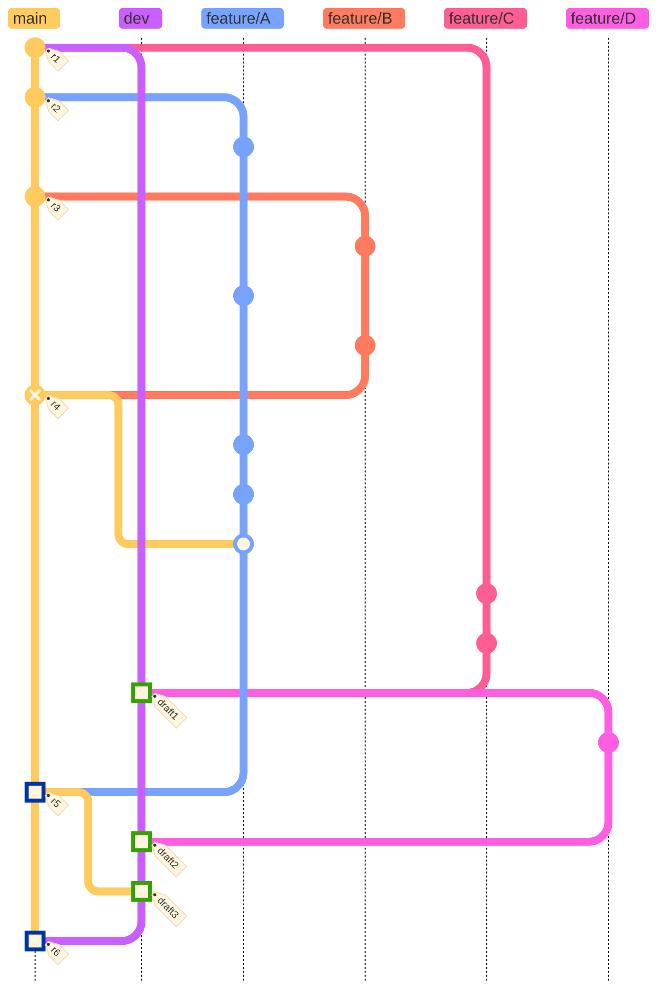

# `rhenning/resume`

## FAQ

### Who are you?

_**Hi.**_ :wave:

My name is Richard Henning—"Rich" to most—a technologist, software engineer,
and creative hailing from Philadelphia, _City of Brotherly Love_ and birthplace of the
United States, where I live with my partner, daughters, and a lovable mutt.

I'm a tech industry veteran with more than twenty years of experience, helping
companies design, implement, provision, sustainably operate, and continuously
deliver change to always-on web systems, cloud, and on-prem infrastructure at
scale.

Some amazing products and teams I've had the pleasure of working on include:

* _Max_ @ Warner Bros. Discovery
* _HBO Max_ @ WarnerMedia
* _Xfinity Stream_ and the _X1 Video Platform_ @ Comcast/Xfinity
* the _Workarea Commerce Platform_ @ Weblinc Commerce
* _NeatCloud_ @ The Neat Company
* _Jux_, _LimeBits_, _LimeDomains_, and _LimeExchange_ @ The Lime Group
  (LimeWire's parent organization)
* Managed Internet services @ Fastnet & NetAxs — popular ISP/MSPs of
  the Greater Philadelphia area, specializing in business and residential
  Internet, web server hosting, colocation, carrier & business networking,
  email, DNS, newsgroups, observability, disaster recovery, managed data
  centers, and professional consulting services.

### Where can I see your résumé?

Please visit this project's **[list of most recent Releases and Assets][releases]**, where you
can find and download documents suitable for viewing. PDF is recommended
for human beings, but several additional formats are available for convenience.
PDF, GitHub-flavored Markdown, HTML, and DOCX (Microsoft Office Open XML)
are available at the time of writing.

### What's all this "Releases and Assets" jargon?

My résumé is stored and maintained _as code_ in this GitHub repository, leveraging
development, test, build, and delivery practices that are common to many modern
software engineering projects.

The document's text and layout instructions for the various output formats are
maintained as source code, subject to revision control. Modifications are made
in topic branches—enforced by security settings on the repository—where an
associated [GitHub Actions pipeline][pipeline] picks up changes, subjects them to a bit of
static analysis, and attempts to convert the proposed copy and layout to the
desired output formats.

If all goes well, the rendered documents are archived for review, and will be
published for public download upon merge of the topic branch into the `main`
branch.

If not, failed pre-flight checks or build steps are flagged as such, and suggestions
intended to resolve these failures may be included on associated pull requests, in
the form of code suggestions and PR comments. The topic branch is blocked from
being merged until these issues have been resolved by follow-up commits on the
topic branch.

Branches named `dev` or matching the pattern `v[0-9]*` (_i.e._ beginning with the
letter `v` and a digit, optionally followed by additional text) are handled as special
cases, intended as perennial children of the `main` branch. Merging pull requests
to these branches generates _non-public draft_ pre-releases by default, while merges
to `main` are published for download by the general public.

I've glossed over a good bit of fine detail above. In spirit of that old adage _a
picture is worth a thousand words_, a few are included below.

A [legend with the various node shapes labeled for reference][git-legend] is available.

### How did you get involved in the tech industry?

I've been fascinated both by making things and taking them apart, in order to
understand what makes them tick, for about as long as I can remember, much to
the dismay of my patient and loving parents at times.

Perhaps that was Dad's motivation for giving the gift of a used Commodore all
along—I might stop taking apart his turntable and guitar pedals.

I got hooked, and spent my formative years getting to know others in the local
BBS scene, exploring the use of MOD trackers and early MIDI synthesizers—some
built by _Ensoniq_, a firm founded by former Commodore engineers—as music
production tools, learning basic microelectronics, and finding my way around the
early Internet with a little help from my friends.

When it was time to choose a career path, it seemed only natural to continue in a
related direction. I began exploring Linux as a primary OS toward the end of high
school and throughout early college, inspired by a friend and mentor who showed
me the ropes of open source and how Linux could breathe new life into "obsolete"
hardware repurposed for server and embedded applications.

Throughout my first "real" technology job after college, I continued to explore the
application of Linux, Unix, and free software to computing problems both at home
and at work—despite it being a "_Windows_ shop"—with zero budget, but keen to
limit the toil and manual process associated with my daily work.

When _Fastnet_—a Philadelphia-area ISP and hosting provider I very much respected—
was seeking out Linux sysadmins, I jumped at the opportunity, had an interview,
and was thrilled to receive an offer letter, which I gratefully accepted.

I learned _so much_ during my time at Fastnet, remaining there for about eight years—
the longest stint of my career—and surviving the dot-com boom, bust, a merger
with _NetAxs_—another well-regarded Philly-area ISP—and two follow-up acquisitions.
It was there I learned to apply the fundamentals of what would later become known
as _DevOps_ and _Pair Programming_, sharing in these prototype cultures before those
terms were in vogue. It wasn't out of deference to any sort of ideology; software
automation and version control enabled us to reliably build, provision, operate and
scale the infrastructure and services needed to support a rapidly-growing business,
with slim budgets and a small staff.

That experience left quite an impression, for which I owe a great debt of gratitude
to my mentors and colleagues, several of whom have become lifelong friends.

Since that time I've been fortunate to work for a number of forward-looking tech
organizations with amazing teams spanning varied domains, including Media and
Entertainment, Public and Private Cloud, E-commerce, Internet and Data Center
Services, Telecommunications, Web and Server Hosting, and Document Intelligence,
Organization, Generation, and Archival.

## Gratitude and Respect

This source code repository, the automation within, and generated artifacts depend
upon software components that have been built, refined, and maintained by members
of the [_Free and Open-Source Software (FOSS)_][FOSS] community from around the globe, many
of whom are _volunteers_ who have donated their labor and expertise to the public
domain of their own free will.

Open-source software stewardship is a necessary, yet often thankless, labor of love,
without which many of the technology products and companies we love would not
exist as they do today.

**Thank You to all open-source contributors for your hard work and generosity.**

[FOSS]: https://en.wikipedia.org/wiki/Free_and_open-source_software
[releases]: https://github.com/rhenning/resume/releases
[pipeline]: https://github.com/rhenning/resume/actions
[git-legend]: doc/branch-legend.md
