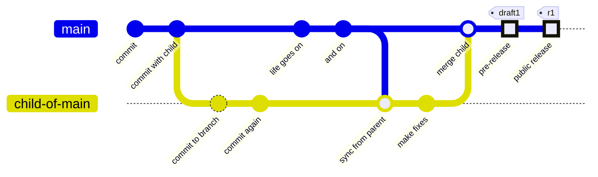

# Git Graph Legend

Here is a simplified example with various node shapes labeled for reference.

```mermaid
gitGraph
  commit id: "commit"
  commit id: "commit with child"

  branch "child-of-main"
  commit id: "commit to branch"
  commit id: "commit again"

  checkout main
  commit id: "life goes on"
  commit id: "and on"

  checkout child-of-main
  merge main id: "sync from parent"
  commit id: "make fixes"

  checkout main
  merge child-of-main id: "merge child"
  commit id: "pre-release" tag: "draft1" type: HIGHLIGHT

  commit id: "public release" tag: "r1" type: HIGHLIGHT
```
