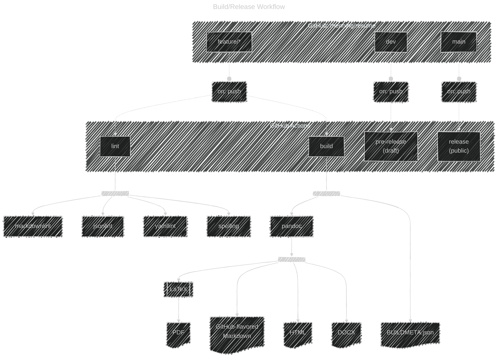

# CI/CD

```mermaid
---
title: Build/Release Workflow
config:
  theme: dark
  look: handDrawn
---
flowchart
  subgraph gh["GitHub: rhenning/resume"]
    featureBranches["`feature/*`"]
    devBranch["`dev`"]
    mainBranch["`main`"]
  end

  subgraph gha[GitHub Actions]
    lintWorkflow@{ shape: process, label: "lint" }
    buildWorkflow@{ shape: process, label: "build" }
    preReleaseWorkflow@{ shape: process, label: "pre-release\n(draft)" }
    releaseWorkflow@{ shape: process, label: "release\n(public)" }
  end

  featureBranches -.-o featurePush@{ shape: event, label: "on: push" } -.-> lintWorkflow
  featurePush -.-> buildWorkflow
  devBranch -.-o devPush@{ shape: event, label: "on: push" } -.-> preReleaseWorkflow
  mainBranch -.-o mainPush@{ shape: event, label: "on: push" } -.-> releaseWorkflow


  lintWorkflow --- lintFork@{ shape: fork }
  lintFork --> markdownlint
  lintFork --> jsonlint
  lintFork --> yamllint
  lintFork --> spelling


  buildWorkflow --- buildFork@{ shape: fork }
  buildFork --> pandoc@{ shape: process } --> pandocFork@{ shape: fork }
  buildFork -----> buildmeta@{ shape: doc, label: "BUILDMETA.json" }

  pandocFork --> latex@{ shape: subprocess, label: "LaTeX" } --> pdf@{ shape: doc, label: PDF }
  pandocFork ---> markdown@{ shape: doc, label: "GitHub-flavored\nMarkdown" }
  pandocFork ---> html@{ shape: doc, label: HTML }
  pandocFork ---> docx@{ shape: doc, label: DOCX }
```
