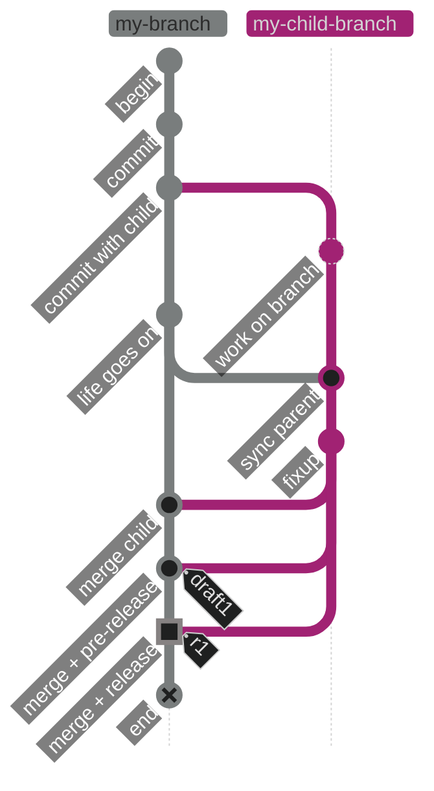

# Git Graph Legend

Here is a simplified example with the various node shapes labeled for reference.

```mermaid
---
config:
  theme: dark
  themeVariables:
    tagLabelFontSize: "1em"
    commitLabelFontSize: "16px"
    commitLabelColor: "#ffffff"
    commitLabelBackground: "#000000"
  gitGraph:
    showCommitLabel: true
    mainBranchName: my-branch
    parallelCommits: false
---
gitGraph TB:
  commit id: "begin"
  commit id: "commit"
  commit id: "commit with child"

  branch "my-child-branch"
  commit id: "work on branch"

  checkout "my-branch"
  commit id: "life goes on"

  checkout my-child-branch
  merge "my-branch" id: "sync parent"
  commit id: "fixup"

  checkout "my-branch"
  merge my-child-branch id: "merge child"
  merge my-child-branch id: "merge + pre-release" tag: "draft1"
  merge my-child-branch id: "merge + release" tag: "r1" type: HIGHLIGHT
  commit id: "end" type: REVERSE
```
